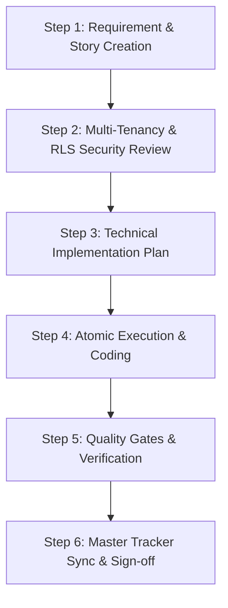
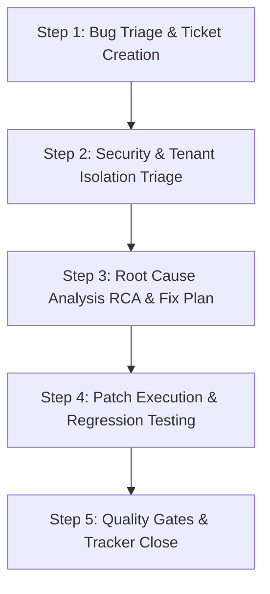

# AI-Assisted Development Workflow Guide

This document defines the official **Story-Driven & Tracking-First AI Development Workflow** for the Multi-Tenant ERP SaaS. Every AI agent and developer must strictly follow this workflow when building new features or resolving bugs.

---

## 1. Core Operating Principles

1. **Multi-Tenancy is Sacred**: Every database table, query, and API handler must enforce `company_id` isolation via Supabase RLS and server-side `auth.uid()` derivation.
2. **No Orphan Work**: No code is written without a corresponding **Story (`STORY-xxx`)** or **Bug Ticket (`BUG-xxx`)** tracked in `TRACKER.md`.
3. **Atomic & Verifiable Steps**: Work in small, testable chunks (Schema → API → UI → Polish → Verification).
4. **Mobile-First & PWA-Ready**: All UI must be validated at 375px viewport before marking tasks complete.
5. **Real-Time Tracker Synchronization**: The tracker is updated before, during, and after work execution.

---

## 2. Taxonomy & Identifiers

| Item Type | Identifier Format | Example | Branch Pattern |
|---|---|---|---|
| **Phase Task** | `<PhaseNumber>.<TaskNumber>` | `3.2` | `feat/attendance` |
| **User Story** | `STORY-<3-digit-id>` | `STORY-012` | `feat/attendance-story-012` |
| **New Feature** | `FEAT-<3-digit-id>` | `FEAT-005` | `feat/projects-feat-005` |
| **Bug / Defect** | `BUG-<3-digit-id>` | `BUG-008` | `fix/clients-bug-008` |

### Status Lifecycle
- `⬜ Backlog / Not Started` — Created and triaged, awaiting assignment
- `🔄 In Progress` — Active implementation underway on assigned branch
- `🔍 In Review / Testing` — Code complete; undergoing verification gates and RLS testing
- `✅ Done / Resolved` — Verified, strict types passing, build passing, merged
- `🚫 Blocked` — Paused due to dependency or technical blocker (flagged in tracker)

---

## 3. Workflow 1: AI-Assisted Feature Development

Follow this 6-step lifecycle for every new feature:



### Step 1: Requirement & Story Creation
1. Extract user requirement or feature spec.
2. Create a new story file under `phases/stories/` or `docs/stories/` using [`templates/story-template.md`](file:///c:/Users/dilsh/OneDrive/Desktop/ERP/templates/story-template.md).
3. Assign next sequential ID (e.g. `STORY-007`).
4. Write acceptance criteria using **Given-When-Then** format.
5. Register story entry in `TRACKER.md` under **Active Stories & Features** with status `🔄 In Progress`.

### Step 2: Multi-Tenancy & RLS Security Review
Before writing any database code, confirm:
- `company_id uuid references companies(id)` is present.
- Supabase RLS policy is drafted:
  ```sql
  alter table <table> enable row level security;
  create policy tenant_isolation on <table>
    using (company_id = (select company_id from profiles where id = auth.uid()));
  ```
- No client-supplied `company_id` will be trusted.
- If modifying schema, create migration file: `supabase/migrations/YYYYMMDDHHMMSS_<desc>.sql`.

### Step 3: Technical Implementation Plan
Break down work into sequential subtasks:
1. **Schema & Migrations**: Table definition, indexes, RLS policies.
2. **Validation**: Zod schema in `lib/validations/`.
3. **API / Route Handlers**: Route handlers with `{ data, error }` response shape.
4. **UI Components**: Server Components for data, Client Components for interactivity.
5. **Responsive Styling**: Tailwind-only, mobile-first (375px), Indian formats (`formatINR`, etc.).

### Step 4: Atomic Execution & Coding
- Checkout feature branch: `git checkout -b feat/<module>-story-<id>`
- Execute each subtask sequentially.
- Strict TypeScript rules: `strict: true`, zero `any`, explicit return types.
- Server Components by default; `'use client'` only when needed for state/browser APIs.

### Step 5: Quality Gates & Verification
Run the 6-point verification suite:
```bash
# 1. Check TypeScript compilation
npm run typecheck

# 2. Check Linting rules
npm run lint

# 3. Check Next.js production build
npm run build
```
- **Mobile Viewport Test**: Verify page layout at 375px width (no horizontal overflow, touch targets ≥ 44px).
- **RLS Multi-Tenant Test**: Confirm user in Tenant A cannot read or write Tenant B records.
- **Unauthenticated Check**: Confirm route redirects unauthenticated users to `/login`.

### Step 6: Master Tracker Sync & Sign-Off
1. Mark the story as `✅ Done` in the story file.
2. Update `TRACKER.md`:
   - Set status to `✅ Done` under **Active Stories & Features**.
   - If migrations were added, log in **Database Migration Status**.
   - If architecture decisions were made, log in **Decisions & Notes Log**.
3. Merge feature branch into module branch or `main`.

---

## 4. Workflow 2: AI-Assisted Bug Fixing & Incident Handling

Follow this 5-step lifecycle for defects and bugs:



### Step 1: Bug Triage & Ticket Creation
1. Gather reproduction steps, error logs, and tenant context.
2. Create a new bug file under `phases/bugs/` or `docs/bugs/` using [`templates/bug-template.md`](file:///c:/Users/dilsh/OneDrive/Desktop/ERP/templates/bug-template.md).
3. Assign next sequential ID (e.g. `BUG-004`).
4. Set Severity:
   - **P0 (Blocker)**: Data leak across tenants, auth bypass, total downtime.
   - **P1 (High)**: Core business capability broken (e.g. check-in fails, invoice generation broken).
   - **P2 (Medium)**: Non-critical feature failure, edge-case validation failure.
   - **P3 (Low)**: Minor UI glitch, alignment issue, typo.
5. Register in `TRACKER.md` under **Bug & Defect Registry** with status `🛠️ In Fix`.

### Step 2: Security & Tenant Isolation Triage
- If there is any suspicion of cross-tenant data leakage or RLS failure, pause feature work immediately.
- Inspect Supabase RLS policies and server-side profile lookups.

### Step 3: Root Cause Analysis (RCA) & Fix Plan
- Identify exact failure layer: Database / RLS / Middleware / API / UI Component.
- Document the technical cause and draft the minimal, robust fix.

### Step 4: Patch Execution & Regression Testing
- Checkout fix branch: `git checkout -b fix/<module>-bug-<id>`
- Apply minimal patch to resolve root cause.
- Re-run exact reproduction steps to confirm defect is resolved.
- Verify adjacent features have not regressed.

### Step 5: Quality Gates & Tracker Close
1. Run `npm run typecheck`, `npm run lint`, and `npm run build`.
2. Update bug ticket status to `✅ Resolved`.
3. Update `TRACKER.md`:
   - Set bug status to `✅ Resolved` in **Bug & Defect Registry**.
   - Add preventative lessons to **Decisions & Notes Log**.

---

## 5. AI Agent Prompt Recipes

Use these standard prompt templates when instructing an AI agent to perform tasks:

### Recipe A: Generating a Story from User Request
```markdown
You are working on the Multi-Tenant ERP SaaS. 
Please convert the following user requirement into a formal User Story using `templates/story-template.md`:

Requirement: "[Describe new feature requirement here]"

Requirements:
1. Assign the next story ID (e.g., STORY-00X).
2. Fill out all sections including Persona, Acceptance Criteria (Given-When-Then), and Multi-Tenancy / RLS rules.
3. List all files to be created/modified across schema, API, and UI.
4. Add the entry to `TRACKER.md` under Active Stories.
```

### Recipe B: Implementing a Feature Story
```markdown
Please implement [STORY-XXX: Title] following the AI-Assisted Development Workflow:

1. Review acceptance criteria in the story document.
2. Confirm multi-tenancy isolation (company_id + RLS).
3. Implement backend validation, API route, and frontend UI components.
4. Run strict verification: `npm run typecheck`, `npm run lint`, `npm run build`.
5. Test responsive layout at 375px mobile viewport.
6. Update the story document and `TRACKER.md` to ✅ Done.
```

### Recipe C: Investigating & Fixing a Bug
```markdown
Please investigate and fix the following defect using `templates/bug-template.md`:

Defect: "[Describe observed error or behavior]"
Subdomain/Tenant: "[e.g. acme]"
Role: "[e.g. employee]"

Instructions:
1. Assign next BUG-XXX ID and log in `TRACKER.md`.
2. Perform Root Cause Analysis (RCA) and check tenant isolation impact.
3. Implement minimal targeted fix.
4. Verify fix against reproduction steps.
5. Run build, lint, and type checks.
6. Update `TRACKER.md` to ✅ Resolved.
```

---

## 6. Pre-Commit Quality Checklist

Never commit or mark a story/bug done until all items pass:

| Gate | Check Command / Action | Acceptance Criteria |
|---|---|---|
| **TypeScript** | `npm run typecheck` | Zero errors (`Found 0 errors`) |
| **Linting** | `npm run lint` | Zero warnings or errors |
| **Build** | `npm run build` | Next.js production build succeeds |
| **Mobile Viewport** | 375px DevTools / browser check | No horizontal scrolling, touch friendly |
| **Multi-Tenancy** | RLS audit | `company_id` filtered via `auth.uid()`, no client leaks |
| **Tracker Sync** | `TRACKER.md` updated | Status, migrations, and decisions updated |
